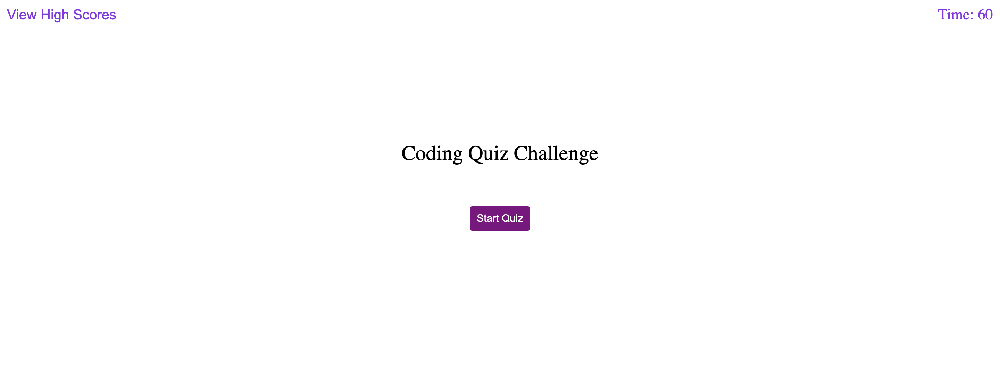
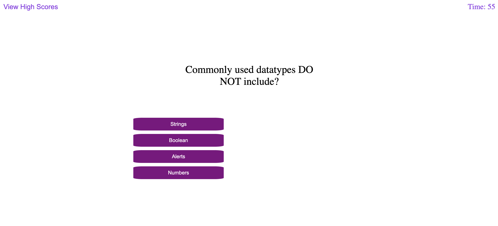
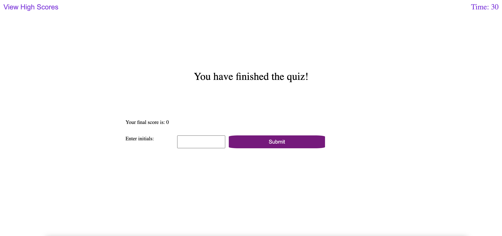

# WEB API CHALLENGE- Code Quiz
The Quiz code is implemented using CSS and Javascript with multiple choice question and to make it even more interesting also added timer.
This code quiz can be shared and challenge others and can also the view the high scores.

# Screens:
* The initial page has View score option with 60 sec timer set once the quiz is started

* Once the quiz is started the countdown starts and the screen shows questions with multiple choice answers to be selected from.

* As the users chooses the answers the series of question is displayed with "Correct" or "Wrong" answers. After the completion of the quiz, your score is shown and the user is asked to put their initials to add the score on the score board.

Git Hub Repository:

Deployed IO:
